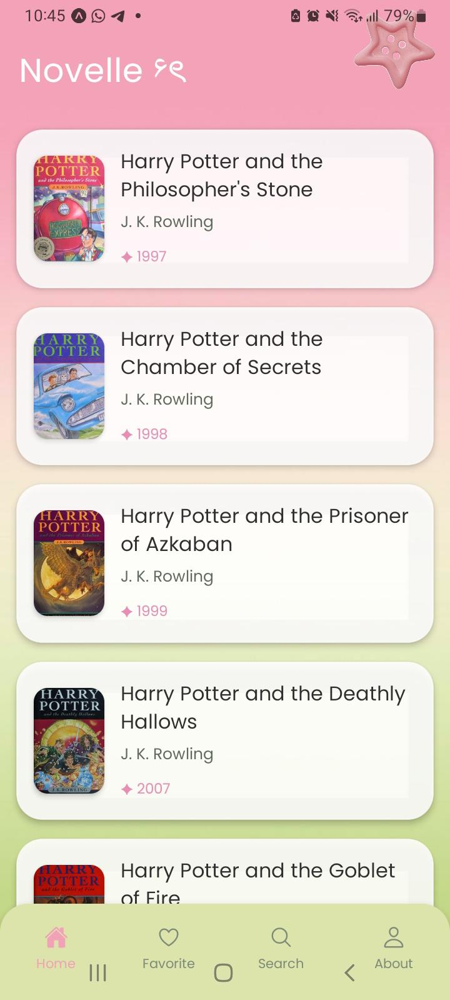
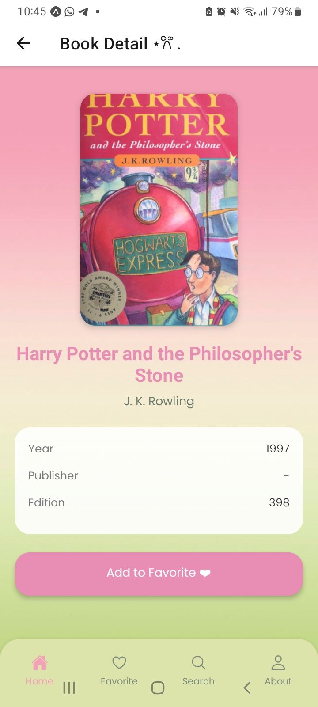
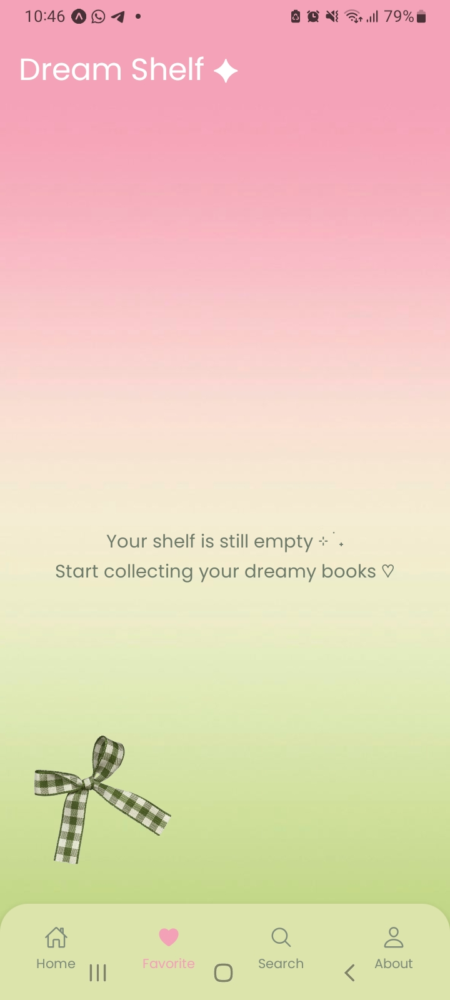
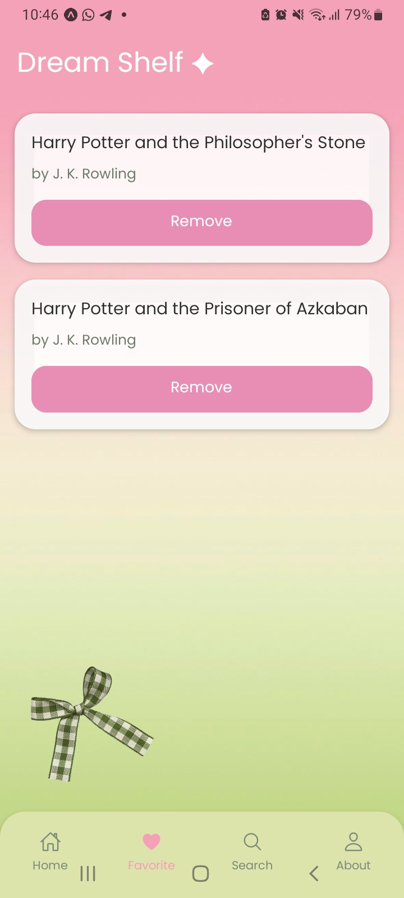
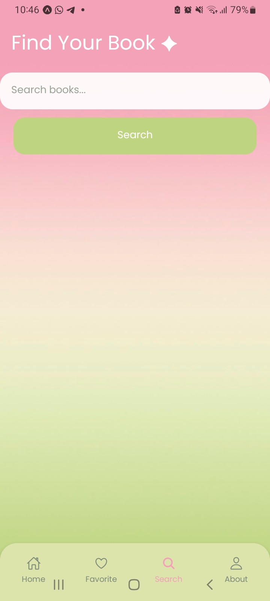
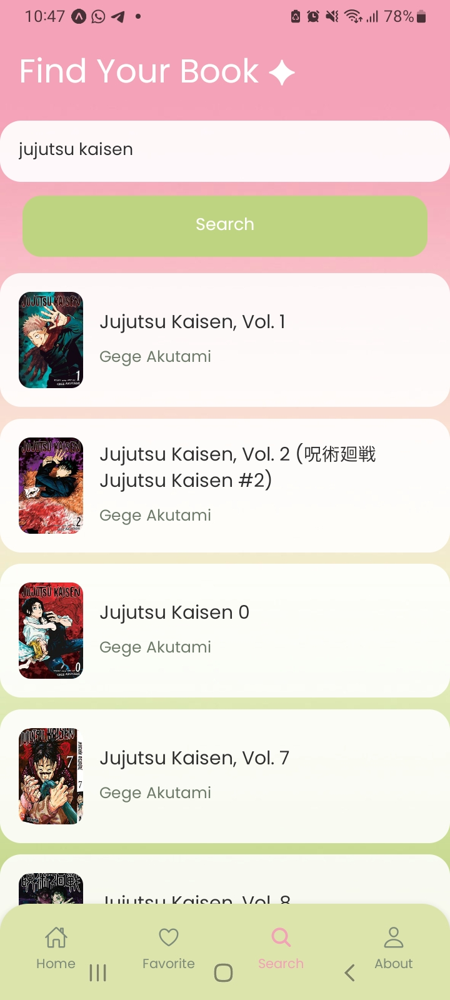
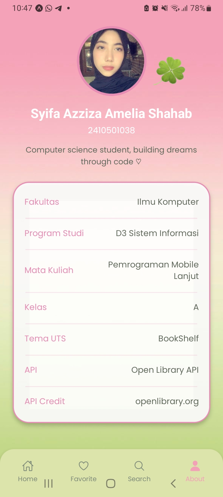

# BookShelf App - UTS Pemrograman Mobile Lanjut

---

## Identitas
- Nama: Syifa Azziza Amelia Shahab  
- NIM: 2410501038  
- Kelas: A  
- Mata Kuliah: Pemrograman Mobile Lanjut  

---

## Tema Aplikasi
BookShelf App adalah aplikasi mobile berbasis React Native yang digunakan untuk menampilkan daftar buku, melihat detail buku, mencari buku, serta menyimpan buku ke dalam daftar favorit pengguna.

---

## Tech Stack
- React Native (Expo)
- React Navigation (Stack & Bottom Tab Navigation)
- Context API (State Management)
- Open Library API
- JavaScript (ES6)

---

## API yang Digunakan
- Open Library API  
- Endpoint: https://openlibrary.org/search.json  

### Credit API
Data provided by Open Library API (https://openlibrary.org)

---

## Fitur Aplikasi

- 📖 Home: Menampilkan daftar buku
- 🔍 Search: Pencarian buku (minimal 3 karakter)
- 📄 Detail: Menampilkan detail buku lengkap
- ❤️ Favorite: Menyimpan & menghapus buku favorit
- 👤 About: Informasi mahasiswa + credit API

---

## Screenshots

### Home


### Detail


### Favorite (Empty State)


### Favorite (With Data)


### Search Page


### Search (Result)


### About


---

## Video Demo
Link video:
https://drive.google.com/file/d/1Vb60rT3IP84IfM8BeFejzTLCcigZPzX7/view?usp=drivesdk

---

## State Management
Aplikasi ini menggunakan **Context API** untuk mengelola data favorit agar dapat diakses di seluruh halaman tanpa props drilling.

---

## Error Handling
- Jika data tidak tersedia akan muncul pesan "No books loaded"
- Validasi search minimal 3 karakter
- Input kosong pada search tidak diproses

---

## Refleksi
Aplikasi ini membantu saya memahami konsep React Native seperti navigation, state management, dan konsumsi API. Selain itu, saya belajar bagaimana mengelola data global menggunakan Context API serta menangani error handling dan validasi input pada aplikasi mobile. Tantangan terbesar adalah mengatur struktur navigation agar antar halaman dapat saling terhubung dengan baik, namun hal tersebut membantu saya memahami arsitektur aplikasi mobile secara lebih mendalam.

## 🚀 Cara Install & Menjalankan Project

1. Clone repository
```bash id="clone"
git clone https://github.com/username/uts-mobile-lanjut.git
cd uts-mobile-lanjut
npm install
npx expo start